# Arquitetura de Software

## Indice

<!-- TOC -->
* [Arquitetura de Software](#arquitetura-de-software)
  * [Projeto Base](#projeto-base)
  * [Funcionalidades a Implementar](#funcionalidades-a-implementar)
    * [Geração automaticamente códigos SKU de produtos](#geração-automaticamente-códigos-sku-de-produtos)
    * [Geração recomendações de ‘reviews’](#geração-recomendações-de-reviews)
    * [Suporte de multiplas bases de dados](#suporte-de-multiplas-bases-de-dados)
  * [Capacidade de trocar os algoritmos e bases de dados que pretendemos](#capacidade-de-trocar-os-algoritmos-e-bases-de-dados-que-pretendemos)
  * [Arquitetura Implementada](#arquitetura-implementada)
  * [Bootstrapper](#bootstrapper)
    * [Descrição](#descrição)
    * [Motivo da abordagem](#motivo-da-abordagem)
      * [Exemplo: h2ProductBootstrapper](#exemplo-h2productbootstrapper)
      * [Exemplo: mongoProductBootstrapper](#exemplo-mongoproductbootstrapper)
      * [Exemplo: neo4jProductBootstrapper](#exemplo-neo4jproductbootstrapper)
  * [Controllers](#controllers)
    * [Descrição](#descrição-1)
    * [Controllers](#controllers-1)
  * [Services](#services)
    * [Descrição](#descrição-2)
    * [Services](#services-1)
  * [Model](#model)
    * [Descrição](#descrição-3)
      * [Exemplo: Product](#exemplo-product)
      * [Exemplo: MongodbProduct](#exemplo-mongodbproduct)
  * [Desenvolvimento do repositorio](#desenvolvimento-do-repositorio)
    * [Arquitetura](#arquitetura)
      * [Solução escolhida](#solução-escolhida)
      * [MongoDBUserRepository.java](#mongodbuserrepositoryjava)
  * [Soluções opcionais consideradas](#soluções-opcionais-consideradas)
    * [Do ponto de vista Lógica Nivel 1](#do-ponto-de-vista-lógica-nivel-1)
    * [Vista Lógica Nivel 2](#vista-lógica-nivel-2)
    * [Vista Lógica Nivel 3](#vista-lógica-nivel-3)
      * [Vista Física Nivel 1](#vista-física-nivel-1)
      * [Vista Física Nivel 2](#vista-física-nivel-2)
    * [Vista Lógica Nivel 1](#vista-lógica-nivel-1)
    * [Vista Lógica Nivel 2](#vista-lógica-nivel-2-1)
    * [Vista Lógica Nivel 3](#vista-lógica-nivel-3-1)
    * [Vista Lógica com Vista Implementação](#vista-lógica-com-vista-implementação)
  * [Vista de Processos Nivel 1](#vista-de-processos-nivel-1)
* [Funcionalidade visualizar os produtos](#funcionalidade-visualizar-os-produtos)
  * [Vista de Processos Nivel 2](#vista-de-processos-nivel-2)
  * [Vista de Processos Nivel 3](#vista-de-processos-nivel-3)
* [Funcionalidade Adicionar um produto](#funcionalidade-adicionar-um-produto)
  * [Vista de Processos Nivel 1](#vista-de-processos-nivel-1-1)
  * [Vista de Processos Nivel 2](#vista-de-processos-nivel-2-1)
  * [Vista de Processos Nivel 3](#vista-de-processos-nivel-3-1)
  * [Arquiteturas Alternativas](#arquiteturas-alternativas)
    * [Sku Generation](#sku-generation)
    * [Review Recommendation Generation](#review-recommendation-generation)
  * [How to run](#how-to-run)
  * [Como foi feita a configuração da aplicação](#como-foi-feita-a-configuração-da-aplicação)
  * [Configuração](#configuração)
    * [Descrição](#descrição-4)
    * [Abordagens](#abordagens)
      * [Configuração da Base de Dados](#configuração-da-base-de-dados)
      * [Gerador de Skus](#gerador-de-skus)
      * [Gerar recomendações de reviews](#gerar-recomendações-de-reviews)
  * [Explicação](#explicação)
      * [Base de dados](#base-de-dados)
      * [Gerador de Skus](#gerador-de-skus-1)
      * [Gerador de recomendaões](#gerador-de-recomendaões)
  * [Segurança](#segurança)
<!-- TOC -->

## Projeto Base

O projeto em questão é uma API Rest em Java, com foco nas seguintes funcionalidades:
criação de produtos, avaliações de produtos ("h2Review"), avaliações de "reviews" e
gestão de utilizadores. Para desenvolver este projeto, utilizamos o modelo de
"software" existente como ponto de partida. Esse modelo serviu como base para uma análise
minuciosa da arquitetura de "software".

Para aplicar a melhoria a nivel arquitetural e das funcionalidades, foi seguido o princípio SOLID:

- **SOLID Princípios:**
    - S — Single Responsibility Principle (Princípio da responsabilidade única)
    - O — Open-Closed Principle (Princípio Aberto-Fechado)
    - L — Liskov Substitution Principle (Princípio da substituição de Liskov)
    - I — Interface Segregation Principle (Princípio da Segregação da Interface)
    - D — Dependency Inversion Principle (Princípio da inversão da dependência)

Para entender o projeto existente, realizamos uma análise da sua arquitetura por meio
do reverse engineering. Isso permitiu identificar a arquitetura a seguir, compreender
a estrutura do projeto, identificar erros existentes, possíveis melhorias e como
implementar as novas funcionalidades propostas.

## Funcionalidades a Implementar

### Geração automaticamente códigos SKU de produtos

No contexto da geração automática de códigos SKU's para produtos, desenvolvemos dois
métodos distintos. O primeiro método baseia-se na descrição do produto, utilizando um
algoritmo de hash. O segundo método segue um padrão alternado de três letras e números,
seguidos de duas letras e dois números, finalizando com um símbolo.

### Geração recomendações de ‘reviews’

No que diz respeito à geração de recomendações para "h2Review," implementamos dois métodos.
O primeiro considera o número de votos positivos e negativos, exigindo um mínimo
de quatro votos positivos, desde que estes representem mais de 60% do total de votos, para
que uma "h2Review" seja recomendada. O segundo método utiliza as classificações dos utilizadores
para encontrar padrões de classificação semelhantes e sugerir críticas que não sejam comuns.

### Suporte de multiplas bases de dados

Para oferecer suporte a múltiplas bases de dados, criamos três classes de configuração
distintas: uma para a base de dados H2, outra para a base de dados Neo4J e uma terceira
para a base de dados MongoDB. Cada uma dessas classes de configuração contém as
configurações específicas necessárias para a respetiva base de dados.


## Capacidade de trocar os algoritmos e bases de dados que pretendemos

Para conseguir trocar os algoritmos e bases de dados que pretendemos, foi necessário
criar uma classe de configuração que permite a troca dos algoritmos e bases de dados
que pretendemos. Esta classe de configuração é executada quando a aplicação é iniciada 
sendo feita a leitura das configurações sendo feita a ligação com a base de dados, e também
é decidido qual o gerador de códigos SKU que é usado e o algoritm de recomendações de
‘reviews’ pretendido. Para conseguirmos fazer isto aplicamos o design pattern,
chamado adapter pattern, que permite a troca de algoritmos e bases de dados que
pretendemos.


## Arquitetura Implementada

A arquitetura implementada é arquitetura Clean, que é uma arquitetura de software que
permite a criação de aplicações com baixo acoplamento e alta coesão. A arquitetura Clean
consiste em camadas de ‘software’ e dependências entre essas camadas. A arquitetura Clean
é composta por quatro camadas:Drivers, Adapters, Application Bussiness rules e Enterprise business rules.

Esta arquitetura foi escolhida porque como dito anteriormente, para esta solução esta
arquitetura demonstrou se para nós a mais adequada e que mais se adequava à aplicação
do princípio SOLID, que é a nossa lei a ser sempre respeitada.

A arquitetura implementada é arquitetura Clean, que é uma arquitetura de software que
permite a criação de aplicações com baixo acoplamento e alta coesão. A arquitetura Clean
consiste em camadas de ‘software’ e dependências entre essas camadas em que as mesmas são:
Drivers, Adapters, Application Bussiness rules e Enterprise business rules.

Esta arquitetura foi escolhida porque como dito anteriormente, para esta solução esta
arquitetura demonstrou se para nós a mais adequada e que mais se adequava à aplicação
do princípio SOLID, que é a nossa lei a ser sempre respeitada.

Portanto, a nossa solução foi desenvolvida da seguinte forma:

## Bootstrapper

### Descrição

O bootstrapper é uma classe executada na inicialização da aplicação,
cujo propósito é preencher a base de dados com dados de teste. No entanto,
essa classe só é executada quando a base de dados se encontra vazia.

Para implementar essa funcionalidade, criamos uma estrutura organizada
em pastas, com uma pasta designada para cada tipo de base de dados, e
dentro de cada uma delas, uma classe para cada modelo.

### Motivo da abordagem

Adotamos essa abordagem de organização devido às diferenças nos modelos
de cada base de dados. Cada tipo de base de dados possui uma população
específica de objetos, como podemos observar nos exemplos a seguir,
referentes ao objeto Product.

#### Exemplo: h2ProductBootstrapper

```java
if(pRepo.findBySku("asd578fgh267").isEmpty()){
        Product p1=new Product("asd578fgh267","Pen","very good nice product");
        pRepo.save(p1);
        }
```

#### Exemplo: mongoProductBootstrapper

```java
if(pRepository.findBySku("asd578fgh267").isEmpty()){
        MongoDBProduct p1=new MongoDBProduct("asd578fgh267","Pen","very good nice product");
        pRepository.save(p1);
        }
```

#### Exemplo: neo4jProductBootstrapper

```java
if(repository.findBySku("asd578fgh267").isEmpty()){
        Neo4jProduct p1=new Neo4jProduct("asd578fgh267","Pen","very good nice product");
        repository.save(p1);
        }
```

---

## Controllers

### Descrição

Os Controllers são fundamentais para as aplicações web. São os responsáveis pelo tratamneto e processamento dos pedidos
de entrada dos clientes. E tratam da gestão do fluxo de dados e das interações numa aplicação.

### Controllers

Após analisar o que era necessário, percebemos a existência de duas soluções possiveis das quais optamos pela que nos pareceu
mais correta aquiteturalmente.

A primeira abordagem para os Controllers foi a criação de um controller para cada base de dados, ou seja, um controller
para a base de dados neo4j e outro controller para a base de dados mongodb, rapidamente percebemos que estaria
uma arquitetura errada, visto que:

- Seria dificil de manter, pois, se quisessemos adicionar novas requests ou base de dados teriamos de adicionar o
  metodos em todos os controllers e ainda teriamos de adicionar outro controller só para a nova base de dados.
- Não segue o princípio de Open and closed principle que dita que as classes devem estar abertas para extensão e
  fechadas para modificação, ou seja, se quisermos adicionar uma nova request, teriamos de modificar cada controller

A outra abordagem para os Controllers era chamar as interfaces implementadas nos services para aplicar o princípio
de dependency inversion. Esta abordagem foi a escolhida, pois, segue os princípios SOLID e é uma arquitetura mais
fácil de manter.

- Segue o princípio de depency inversion, pois, os controllers dependem de interfaces e não de implementações,
- Para adicionar uma nova base de dados apenas precisamos de adicionar o seu novo repositorio.

---

## Services

### Descrição

Os Services são fundamentais para as aplicações web. São os responsáveis especialemente pelas regras de negócio a serem
aplicadas aos dados recebidos pelos controllers.

### Services

Assim como os Controllers, a primeira abordagem para os Services foi a criação de um service para cada base de dados, o
que iria gerar os mesmos problemas referidos anterirormente:

- Seria dificil de manter
- Não segue o princípio de Open and closed principle 

A outra abordagem para os Services era chamar as interfaces implementadas nos repositories para aplicar o princípio


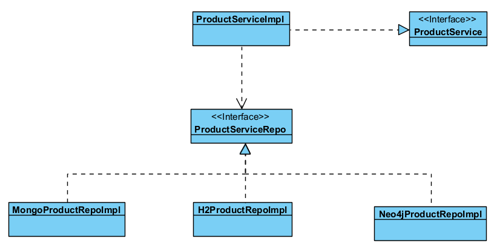

A abordagem demonstrada na imagem permite então abstrair os services das implementações dos repositories, ou seja,
os services apenas dependem das interfaces dos repositories e não das implementações, usando assim o dependency inversion.

---

## Model

### Descrição

A camada de model é responsável por representar os objetos da aplicação.
Nessa camada, temos classes que representam os objetos usados na aplicação.

Optamos por criar um modelo separado para cada tipo de base de dados,
devido às diferenças nas anotações e na estrutura de cada classe do modelo. Cada base de dados tem suas próprias
anotações e, portanto, é necessário criar as classes do modelo separadamente para evitar conflitos.

Como exemplo, podemos analisar a classe Product. No caso de uma
base de dados relacional, como H2, a classe possui anotações específicas,
conforme o exemplo a seguir:

#### Exemplo: Product

```java
 @Id
@GeneratedValue(strategy = GenerationType.AUTO)
private Long productID;

@Column(nullable = false, unique = true)
public String sku;

@Column(nullable = false)
private String designation;

@Column(nullable = false)
private String description;
```

No entanto, ao lidar com o MongoDB, a classe é mais simples, pois o
MongoDB não utiliza anotações. As anotações usadas na base de dados
H2 podem gerar conflitos com o MongoDB:

#### Exemplo: MongodbProduct

```java
private Long productID;

public String sku;

private String designation;

private String description;
```

No caso do Neo4J, as anotações são diferentes das do H2, mas são
necessárias para essa base de dados específica:

```java
    @Id
@GeneratedValue
private Long productID;

@Version
private Long version;

@Property
private String sku;

@Property
private String designation;

@Property
private String description;
```

Esta abordagem de criar um modelo separado para cada base de dados
garante que as anotações e a estrutura sejam adequadas para cada sistema
de armazenamento de dados, evitando conflito e garantindo a integridade
dos dados em cada ambiente de base de dados.

---

## Desenvolvimento do repositorio

### Arquitetura

No desenvolvimento da camada Adapter, criamos os repositórios para
consumir a API das bases de dados. Seguimos os princípios SOLID e
consideramos várias abordagens para implementar essa camada, incluindo
SOLID, generics e reflection. Abaixo, apresentamos a solução escolhida,
as soluções opcionais consideradas e os seus prós e contras.

#### Solução escolhida

Optamos por seguir os princípios SOLID para o desenvolvimento dos
repositórios. Inicialmente, o repositório era uma interface implementada
por uma classe concreta chamada Repository. Porém, à medida que surgiu a
necessidade de usar várias bases de dados com diferentes anotações e
implementações, tornou-se necessário criar um repositório distinto para
cada modelo de dados e base de dados para evitar conflitos.

A arquitetura do repositório é composta por uma interface para cada
modelo e base de dados. Por exemplo, para o modelo de dados "User" e a
base de dados "MongoDB", temos o seguinte:

#### MongoDBUserRepository.java

```java
public interface MongoDBUserRepository extends MongoRepository<User, Long> {
}
```

A interface estende a interface MongoRepository, que é parte do Spring
Data e permite interagir com a base de dados MongoDB, sem a necessidade
de escrever consultas complexas.

Da mesma forma, para a base de dados Neo4J, temos a seguinte estrutura:

```java

@Repository
public interface Neo4JUserRepository extends Neo4jRepository<Neo4jUser, Long> {
}
```

A nossa escolha considerou a simplicidade da implementação,
mesmo que fosse trabalhosa devido à necessidade de criar classes
separadas para cada base de dados.

No entanto, essa simplicidade também apresenta desvantagens.
Se fosse necessário implementar mais bases de dados no futuro,
isso exigiria um esforço considerável para criar um repositório
para cada base de dados e modelo. Mas, para este projeto e a sua
finalidade, essa solução oferece o melhor equilíbrio entre esforço
e tempo, tornando-a a mais eficaz.

## Soluções opcionais consideradas

Duas soluções opcionais foram consideradas:

- **Generics**: Esta abordagem envolve a criação de código genérico que pode
  ser usado com diferentes tipos de dados, eliminando a necessidade de
  escrever código separado para cada tipo de dado. No entanto, a
  complexidade da implementação tornou essa opção menos atrativa.

- **Reflection**: O reflection permite que um ‘software’ examine e altere o seu
  comportamento, estrutura e metadados dinamicamente durante a execução.
  Embora fosse a solução mais completa e eficiente a longo prazo, também
  era a mais complexa de implementar, o que não justificava o esforço
  necessário para este projeto.

A solução baseada nos princípios SOLID foi escolhida devido à sua
simplicidade e eficácia na atual fase do projeto, embora possa exigir
mais esforço caso seja necessário adicionar mais bases de dados no futuro.

#### Vista Física Nivel 1

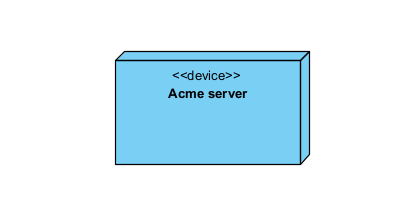

#### Vista Física Nivel 2

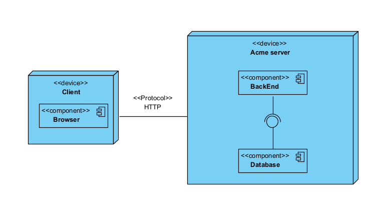

### Vista Lógica Nivel 1

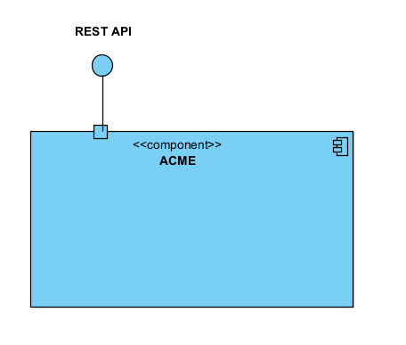

### Vista Lógica Nivel 2

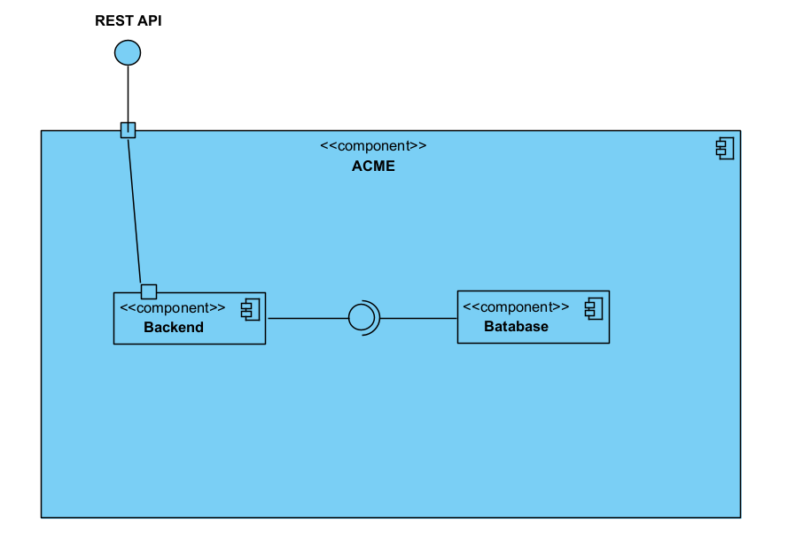

### Vista Lógica Nivel 3

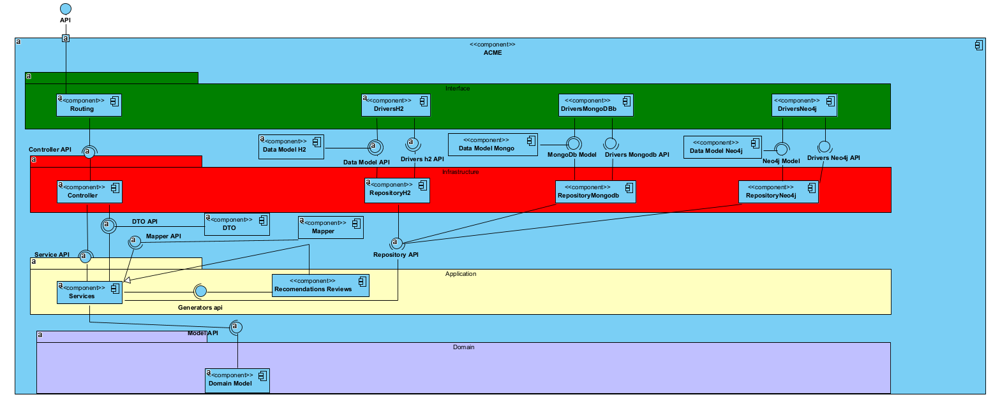

### Vista Lógica com Vista Implementação
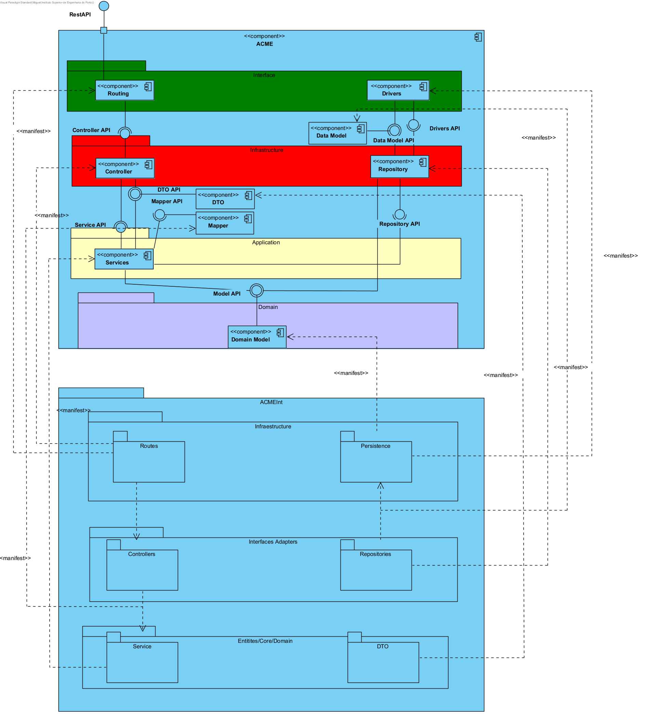

Nesta seção, descrevemos a visualização dos processos de nível 1
relacionados à funcionalidade de visualização de produtos:

A funcionalidade de visualização de produtos permite aos utilizadores
acessar informações sobre os produtos disponíveis no sistema. 
O processo é dividido em três níveis para fornecer detalhes específicos
e orientação sobre como esse recurso é implementado.

- **Vista de Processos Nível 1**: Nível mais alto, representando a funcionalidade em geral.
- **Vista de Processos Nível 2**: Nível intermediário, que detalha etapas intermediárias ou subprocessos.
- **Vista de Processos Nível 3**: Nível mais detalhado, mostrando as etapas específicas e os componentes envolvidos na visualização dos produtos.

## Vista de Processos Nivel 1

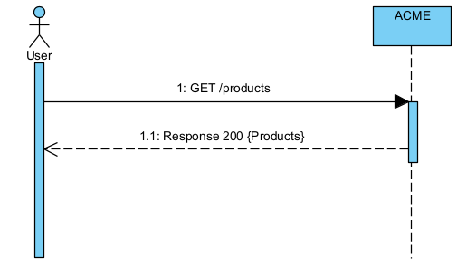

# Funcionalidade visualizar os produtos

## Vista de Processos Nivel 2

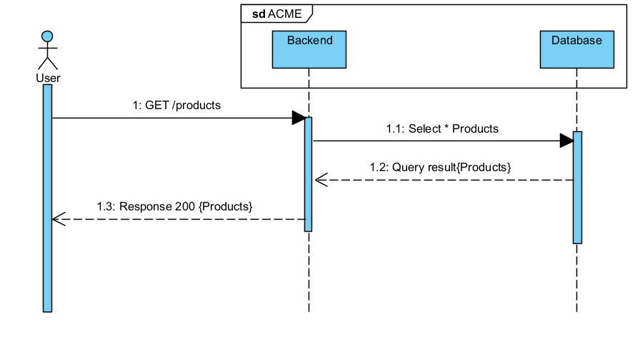

## Vista de Processos Nivel 3

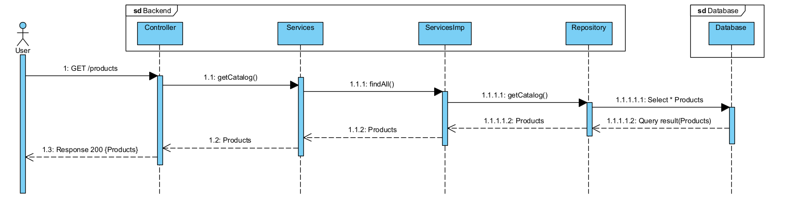

# Funcionalidade Adicionar um produto

Aqui, descrevemos os processos de nível 1 relacionados à funcionalidade
de adicionar um produto:

A funcionalidade de adicionar um produto permite aos utilizadores
inserir novos produtos no sistema. Assim como a funcionalidade de
visualização de produtos, esta funcionalidade é dividida em três
níveis para fornecer detalhes específicos sobre a implementação.

- **Vista de Processos Nível 1**: Nível mais alto, representando a funcionalidade em geral.
- **Vista de Processos Nível 2**: Nível intermediário, detalhando etapas intermediárias ou subprocessos.
- **Vista de Processos Nível 3**: Nível mais detalhado, mostrando as etapas específicas e os componentes envolvidos na adição de um novo produto ao sistema.

## Vista de Processos Nivel 1

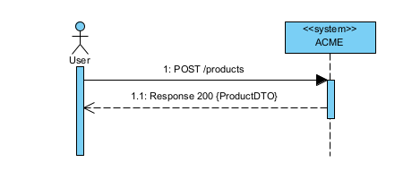

## Vista de Processos Nivel 2

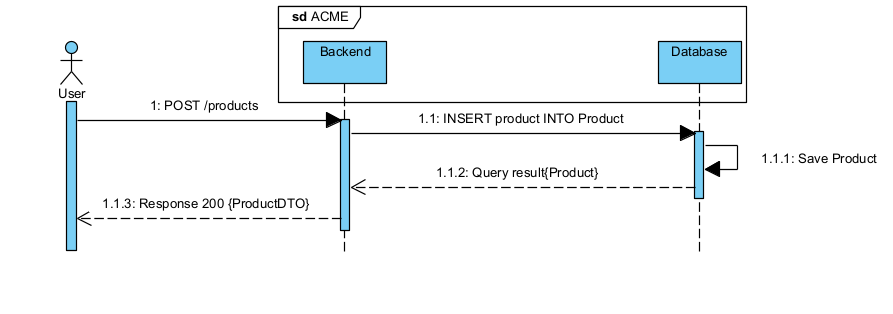

## Vista de Processos Nivel 3

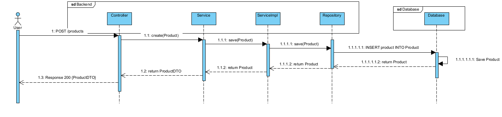


# Funcionalidade de gerar recomendações de reviews

## vista de processos Nivel 3
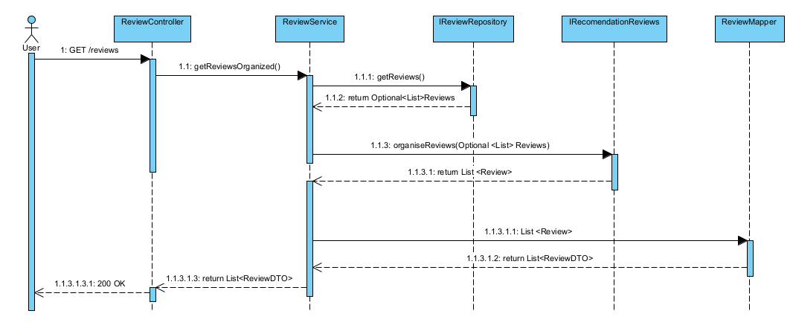

---

## Arquiteturas Alternativas

Durante o desenvolvimento do projeto, foram consideradas várias arquiteturas alternativas para conseguir seguir os
princípios solid.

### Sku Generation

Na seguinte imagem aplicamos o princípio de dependency inversion para conseguir decidir qual dos algoritmos de geração
de skus pretendemos usar.

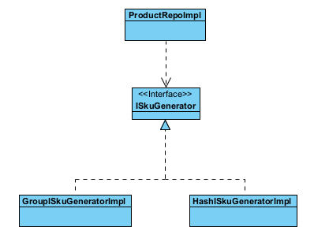

Esta escolha é feita através da seguinte configuração do appliation.properties

```properties
app.sku-generation-strategy=GroupSkuGen
```

### Review Recommendation Generation

Na seguinte imagem aplicamos mais uma vez o principio de dependency inversion para conseguir decidir qual dos algoritmos
de geração de recomendações de reviews pretendemos usar.

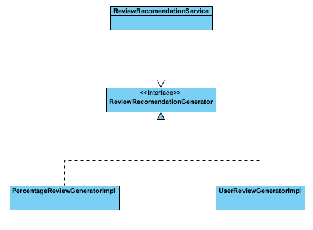

Esta escolha é feita através da seguinte configuração do appliation.properties

```properties
app.recommendation-algorithm=PercentageReviewGeneratorImpl
```

## How to run

Para executar o projeto, é necessário ter o Java 11 e o Maven instalados.
Além disso, para usar a base de dados MongoDB, é necessário instalar o
MongoDB e criar uma base de dados com o nome "acme" na porta 27017.

Para usar a base de dados Neo4J, você deve instalar o Neo4J e criar uma
base de dados com o nome "acme".

## Como foi feita a configuração da aplicação

A configuração do projeto foi realizada por meio da criação de classes
de configuração no pacote "Config". Usamos a anotação @Profile,
que permite ativar um bean para um perfil específico. A classe de
configuração é ativada quando o perfil correspondente é selecionado
no ficheiro .properties.

## Configuração

### Descrição

O package Config contém as configurações da aplicação, que vão ser executadas quando
a API for iniciada. No start up é feita a leitura das configurações sendo feita a ligação
com a base de dados, e também é decidido qual o gerador de códigos SKU que é usado e o algoritm de recomendações de
‘reviews’ pretendido.

### Abordagens

#### Configuração da Base de Dados

Houve a necessidade de seperar as tarefas de configuração entre as diferentes classes para cada base de dados. Para
começar
temos uma configuração para cada base de dados, cada uma contém o seu próprio driver e o seu próprio repository assim
como os repositorios da base de dados que tem e implementar, isto implica que caso não houvesse uma configuração para
cada base de dados os drivers iam entrar em conflito entre si assim como os transaction ‘managers’ de cada base de
dados. Por isso havia duas soluções para impedir que este conflito acontece-se.

A primeira solução implicava deixar o Springboot fazer a sua configuração automática, mas dando uma
prioridade entre qual das bases de dados seria a principal isto usando a annotation```@Primary```.
A segunda solução que optamos implicava fazer uma configuração manual, embora mais trabalhosa consideramos que é o
grande objetivo da unidade curricular, visto que ao fazer manualmente podemos facilmente indicar através do ```Args```
quais são os parâmetros que cada base de dados usa, como se verá mais adiante.

#### Gerador de Skus

Para os skus há duas abordagens possiveis. A primeira sendo criar um ```@Bean``` para instanciar a classe pretendida com
o algorimo pretendido por reflection em que passavamos mais uma vez o valor pretendido pelo ```Args``` e o valor passado
teria de ser o exatamento nome da classe a ser instanciada. A segunda solução encontrada foi por conditional
statements o que não é mantivel a longo praso.

A solução que apresentamos usa a primeira solução, ou seja, por reflection.

#### Gerar recomendações de reviews

Para a configuração da recomendações de reviews, optamos por criar também uma classe à parte que através de reflection
irá instanciar o algoritmo pretendido. Este algoritmo é escolhido através do ficheiro system.properties.

## Explicação

#### Base de dados

A nossa solução é constituida por classes de configuração manual para cada base de dados. O ponto principal é criar um
transcationManger independente para cada base de dados, isto porque como já foi explicado o springboot cria uma
configuração automática e temos conflitos entre transações.
Além disso, para colmatar o problema de multiplas configurações ligadas simultaneamente, criamos perfis para cada base
de
dados, assim permite não criar overhead dentro do programa por termos 3 bases de dados ativas e evita problemas futuros.

**H2Configuration**

```java
@Bean(name = "h2TransactionManager")
public JpaTransactionManager h2TransactionManager(LocalContainerEntityManagerFactoryBean entityManagerFactory)throws Exception{
        JpaTransactionManager transactionManager=new JpaTransactionManager();
        transactionManager.setEntityManagerFactory(entityManagerFactory.getObject());
        return transactionManager;
        }
```

**Neo4jConfig**

```java
    @Bean(name = "neo4jTransactionManager")
public Neo4jTransactionManager neo4jTransactionManager(){
        return new Neo4jTransactionManager(getConfiguration());
        }
```

**MongoConfig**

```java
    @Bean
MongoTransactionManager transactionManager(MongoDatabaseFactory dbFactory){
        return new MongoTransactionManager(dbFactory);
        }
```

Os metodos apresentados demonstram então onde se cria o transactionManager para cada base de dados. Para atingir o
principal obejtivo da unidade curricular, temos também nessa mesma configuração metodos que permitem estabelecer uma
conexão com a base de dados.

**MongoConfig**

```java
    @Override
protected String getDatabaseName(){
        return mongoDbName;
        }

@Override
public MongoClient mongoClient(){
        return MongoClients.create(mongoDbConnectionUri);
        }
@Bean
public MongoTemplate mongoTemplate(){
        return new MongoTemplate(mongoClient(),getDatabaseName());
        }
```

Nesta parte de código do mongodb, existem dois metodos implementados por termos extendido a classe pela classe
abstrata ```AbstractMongoClientConfiguration``` que obriga a implementação desses dois metodos com o ```@Override``` e
por fim temos o metodo ```mongoTemplate()``` que irá então estabelecer de facto a conexão com a base de dados

**Neo4jConfig**

```java
    @Bean
public Driver getConfiguration(){
        return GraphDatabase.driver(neo4jBolt,AuthTokens.basic(Neo4jName,Neo4jPassword));
        }
@Bean
public Neo4jClient neo4jClient(){
        return Neo4jClient.create(getConfiguration());
        }
@Bean(name = "neo4jTransactionManager")
public Neo4jTransactionManager neo4jTransactionManager(){
        return new Neo4jTransactionManager(getConfiguration());
        }
```

Na configuração do neo4j, fazemos quase o mesmo, contudo aqui especificamos o h2User e a password que vão ser usados.

**H2Configuration**

```java
    @Bean(name = "h2")
public DataSource h2Configuration(){
        return DataSourceBuilder.create().driverClassName("org.h2.Driver").username(userName).password(password).url(connectionUri).build();
        }


@Bean(name = "h2TransactionManager")
public JpaTransactionManager h2TransactionManager(LocalContainerEntityManagerFactoryBean entityManagerFactory)throws Exception{
        JpaTransactionManager transactionManager=new JpaTransactionManager();
        transactionManager.setEntityManagerFactory(entityManagerFactory.getObject());
        return transactionManager;
        }
```

A configuração da base de dados H2 é muito identica à do neo4j. Contudo, a base de dados é relacional enquanto o neo4j é
uma base de dados de grafos

#### Gerador de Skus

Como falado anteriormente apresentamos uma solução por reflection, contudo caso falhe irá usar um dos algoritmos
como default

```java
@Bean
public ISkuGenerator skuGenerator(){
        try{
        System.out.println("Selected SKU Generation Strategy: "+skuGenerationStrategy);
        Class<?> clazz=Class.forName("com.isep.acme.generators.Sku."+skuGenerationStrategy);
        System.out.println("Class: "+clazz.getName());
        Constructor<?> ctor=clazz.getConstructor();
        System.out.println("Constructor: "+ctor);
        return(ISkuGenerator)ctor.newInstance();
        }catch(ClassNotFoundException|NoSuchMethodException|InstantiationException|IllegalAccessException|
        InvocationTargetException e){
        return new GroupISkuGeneratorImpl();
        }
        }
```

#### Gerador de recomendaões

Para configurar qual é o algoritmo de recomendações que se pretende usar temos de definir no system.properties o
algoritmo pretendido. Depois disso através da annotation ```@Bean``` o algoritmo é injetado em todos os locais onde
exista
a declaração da interface ```ReviewRecommendationGenerator```.

```properties
app.recommendation-algorithm=PercentageReviewGeneratorImpl
```

## Segurança

Inicialmente, enfrentamos desafios com a segurança ao implementar
autenticação para cada base de dados, principalmente relacionados à
classe Roles, que implementa a interface GrantedAuthority do Spring
Security. Como essa classe não era adequada para ser replicada para
cada base de dados, decidimos temporariamente ignorar a segurança.
Isso permitiu que todas as solicitações fossem feitas a qualquer
endpoint por qualquer utilizador, embora essa não seja uma boa prática
de segurança.

Esta solução provisória foi implementada para permitir o teste da
API e superar as limitações da segurança, mas é importante lembrar
que a segurança é essencial e deve ser tratada adequadamente num
ambiente de produção.

Se houver alguma consideração específica de segurança que precise
ser tratada, recomenda-se resolver essa questão e adotar uma abordagem
de segurança adequada conforme as melhores práticas antes
de implantar o sistema em produção.


